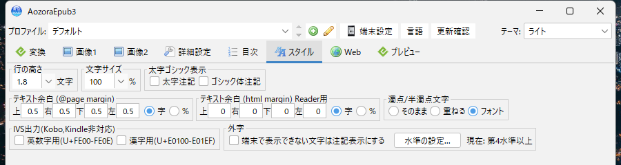
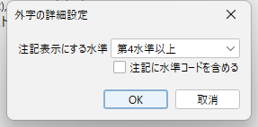
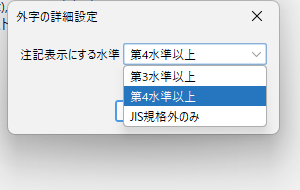

<nav style="background: #f6f8fa; padding: 1em; margin-bottom: 2em; border-radius: 6px;">
  <strong>📚 Documentation:</strong>
  <a href="./">Home</a> | 
  <a href="usage.html">Usage</a> | 
  <strong>Gaiji Settings</strong> | 
  <a href="narou-setup.html">narou.rb Setup</a> |
  <a href="narou-rs-setup.html">narou.rs</a> |
  <a href="development.html">Development</a> | 
  <a href="epub33.html">EPUB 3.3</a> |
  <a href="https://github.com/AozoraEpub3-JDK21/AozoraEpub3-JDK21">GitHub</a>
  <div style="float: right;">🌐 <a href="../gaiji-settings.html">日本語</a></div>
</nav>

## Gaiji Settings (handling characters shown as "?" or tofu boxes)

> ⚠️ **Note**
> - This setting is available in AozoraEpub3-JDK21 v1.6.1-jdk21 and later.
> - It is disabled in the initial state. Unless you change it, the EPUB produced is identical to previous versions.

When a converted EPUB is opened on an e-reader, some kanji may be displayed as **`?` or □ (tofu boxes)**. This page describes how to use the Gaiji setting to address this.

### Symptom

```text
Intended display    𢌞り
Device display      ?り
```

### Cause

Aozora Bunko source text records characters that ordinary encodings cannot represent using a **gaiji annotation**:

```text
※［＃「廴＋囘」、第4水準2-12-11］り
```

AozoraEpub3 converts this annotation to the Unicode character `𢌞` and outputs it. However, `𢌞` belongs to **JIS level 4**, and it may not be included in the font installed on the e-reader. When the font has no matching glyph, the device displays `?` or □.

AozoraEpub3 cannot determine whether the target device is able to display a given character. This setting therefore lets you **stop outputting the character itself and replace it with an annotation that identifies which character it was**.

```text
With the setting enabled   〓（「廴＋囘」）り
```

The description inside the parentheses is displayed in smaller type (right-side inline notation).

---

## Procedure

### 1. Open the Style tab

Open the **Style** tab in the GUI. The Gaiji setting is at the bottom right of the panel.



In the initial state the checkbox is cleared, and the output is the same as before.


> **Note**: If you are not experiencing display problems, there is no need to change this setting. As long as the checkbox is cleared, the EPUB produced is identical to before, character for character.

### 2. Enable the feature

Select the **"Show annotation for characters the device cannot display"** checkbox.


The text shown to the right of the button — **"Current: JIS level 4 and above"** — is the level in effect. You can check the current setting here without opening the dialog.

> ✅ **Checkpoint**: The checkbox is selected, and "Current: JIS level 4 and above" appears to its right.

### 3. Select a level

If you are using the initial value, this step is not required. To change the level, press the **"Set level..."** button.



Select the target level from the "Fall back at level" dropdown.



Press **OK** to apply the setting; the "Current:" text is updated. Press **Cancel** to discard the change.

---

## Setting reference

### Fall back at level

| Value | Characters affected | Behavior |
|---|---|---|
| **JIS level 3 and above** | Levels 3 and 4, and characters outside JIS | The widest setting. Characters such as `俠` and `亍` are also shown as annotations |
| **JIS level 4 and above** (initial value) | Level 4 and characters outside JIS | Check the display with this setting first |
| **Outside JIS only** | Characters not included in JIS X 0213 | The narrowest setting. Levels 3 and 4 are output unchanged |

> **Note**: Levels 3 and 4 are output unchanged under "Outside JIS only" on runtimes that provide the JIS X 0213 character encoding. On runtimes without it, levels 3 and 4 are also affected. Standard JDK builds are unaffected.

### Choosing a level

Adjust in the following order.

1. Convert with the initial value, **JIS level 4 and above**, and check the display on your device
2. If `?` or □ remains, change to **JIS level 3 and above**
3. If characters that do display are turned into `〓`, change to **Outside JIS only**

For reference, out of the 7,949 entries in the gaiji annotation table included with AozoraEpub3, the number affected by each setting is as follows.

| Value | Entries affected | Ratio |
|---|---:|---:|
| JIS level 3 and above | 7,886 | 99.2% |
| JIS level 4 and above | 6,185 | 77.8% |
| Outside JIS only | 3,751 | 47.2% |

> **Note**: The table above shows ratios for the annotation table as a whole. A single work normally contains only a few gaiji, so the bulk of the text will not be replaced with `〓`.

### Include the JIS level code in the annotation

The checkbox at the bottom of the dialog. Select it to keep the Aozora Bunko annotation in its original form.

```text
Cleared    〓（「廴＋囘」）り
Selected   〓（「廴＋囘」、第4水準2-12-11）り
```

The level code helps when identifying the character later, or when reconverting for a different device. It also increases the number of characters per line, which makes lines longer in vertical writing. The initial value is cleared.

When selected, the Gaiji panel shows **"Current: JIS level 4 and above + level code"**.

---

## Output produced by each setting

The following source text is used to compare the settings. The level is "JIS level 4 and above".

```text
注記経由の第4水準は ※［＃「廴＋囘」、第4水準2-12-11］り という字である。
生の第4水準を直接書くと 𢌞り になる。
BMP の第3水準は 俠客 のように書く。
第1・2水準の 崎 や 亜 は影響を受けない。
```

| Setting | Level 4 via annotation | Level 4 written directly | Level 3 | Levels 1–2 |
|---|---|---|---|---|
| **Cleared** (initial value) | `𢌞り` | `𢌞り` | `俠客` | `崎` `亜` |
| **Selected** | `〓（「廴＋囘」）り` | `〓り` | `俠客` | `崎` `亜` |
| **Selected + level code** | `〓（「廴＋囘」、第4水準2-12-11）り` | `〓り` | `俠客` | `崎` `亜` |

Three points can be confirmed from this result.

- **Levels 1 and 2 are never affected.** Common kanji are not replaced with `〓`
- **Level 3 `俠` is output unchanged**, because the level is set to "JIS level 4 and above"
- **A character written directly becomes `〓` alone.** The source contains no description of the character, so there is nothing to identify it with

> **Note**: A gaiji nested inside another annotation (`※［＃「…※［＃…］…」］`) also becomes `〓` alone, without a description, because an annotation cannot be output inside another annotation.

---

## Conversion log

After conversion, the number of characters replaced with an annotation is written to the log.

```text
外字を注記表示にしました: 2 件
```

This line is not output when no replacement occurred.

---

## Configuring from the command line

The same settings can be specified in an ini file. Use this method when driving AozoraEpub3 from narou.rb or narou.rs as well.

The file to edit is **`AozoraEpub3.ini`** in the AozoraEpub3 folder. A different file can be specified with the `-i` option.

> ⚠️ **Note**: The GUI writes `AozoraEpub3.ini` back on exit. When editing the ini directly, **close the GUI first**. Closing the GUI while editing will overwrite your changes.

| Key | Value | Initial value | Description |
|---|---|---|---|
| `GaijiFallback` | `1` / empty | empty (disabled) | Whether to enable this feature |
| `GaijiFallbackLevel` | `3` / `4` / `9` | `4` | 3 = level 3 and above / 4 = level 4 and above / 9 = outside JIS only |
| `GaijiFallbackCode` | `1` / empty | empty (disabled) | Whether to include the JIS level code |

Behavior is not guaranteed for values of `GaijiFallbackLevel` other than those listed. A value that cannot be parsed as a number is treated as the initial value `4`.

Example:

```ini
GaijiFallback=1
GaijiFallbackLevel=4
GaijiFallbackCode=
```

Command:

```bash
java -jar AozoraEpub3.jar -of -enc UTF-8 -i my.ini -d out input.txt
```

> ⚠️ **Note**: Specify `-enc UTF-8` when the input file is UTF-8. When omitted, the file is read as `MS932` (Shift_JIS) and the text is garbled.

---

## Comparison with other approaches

This setting replaces a character that cannot be displayed with an annotation describing it. When **the character itself must be displayed**, use one of the following.

| Approach | Description | Suitable for |
|---|---|---|
| **Gaiji setting** (this page) | Replaces the character with `〓（description）` | Handling the problem simply. Works on any device |
| **Embedded single-character font** | Placing `u2231e.ttf` in `gaiji/` embeds that character's font in the EPUB | Displaying the character as a character. Requires a device that supports embedded fonts |
| **`replace.txt`** | Create a table of characters to replace | Replacing specific characters with characters of your choice |

Single-character fonts are available from [GlyphWiki](https://glyphwiki.org/). File names take the form `u` + the Unicode code point in lowercase. See `gaiji/README.txt` in the distribution for details.

> **Note**: Characters that have a single-character font are not replaced, even with this setting enabled. This applies both to characters produced from a gaiji annotation and to characters written directly in the source, because there is no reason to replace a character that displays correctly.

---

## Frequently asked questions

**Q. Will the output differ from before if I leave the initial state unchanged?**

No. Unless the checkbox is selected, the EPUB produced is identical to before.

**Q. Can a character other than `〓` be used?**

Not at present.

**Q. Does the setting switch automatically per device?**

No. Linking it to device presets is under consideration.

**Q. Is there a list of which characters each device can display?**

No. Display support varies with the combination of device and firmware, so check on the actual device.

---

## Related pages

- **[Usage Guide](usage.html)** — Basic usage and the full setting reference
- **[narou.rb Setup](narou-setup.html)** — Using AozoraEpub3 with narou.rb
- **[narou.rs Setup](narou-rs-setup.html)** — Using AozoraEpub3 with narou.rs
