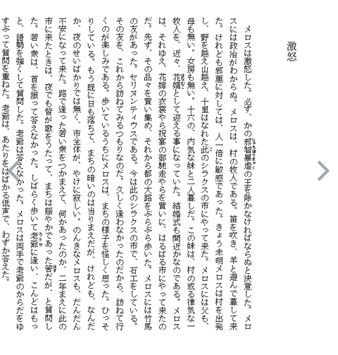
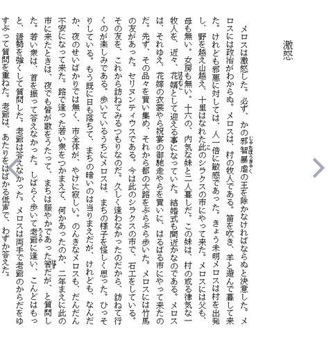

<nav style="background: #f6f8fa; padding: 1em; margin-bottom: 2em; border-radius: 6px;">
   <strong>📚 Documentation:</strong>
   <a href="index.html">Home</a> | 
   <a href="usage.html">Usage</a> | 
   <a href="gaiji-settings.html">Gaiji Settings</a> | 
   <a href="narou-setup.html">narou.rb Setup</a> |
   <a href="narou-rs-setup.html">narou.rs</a> |
   <a href="development.html">Development</a> | 
   <a href="epub33.html">EPUB 3.3</a> |
   <a href="https://github.com/AozoraEpub3-JDK21/AozoraEpub3-JDK21">GitHub</a>
   <div style="float: right;">🌐 <a href="../narou-rs-setup-details.html">日本語</a></div>
</nav>

## narou.rs Setup Guide — Details

This page is a companion to the **[narou.rs Setup Guide](narou-rs-setup.html)**. You do not need it to follow the steps; read it when you want to know why a step is done a certain way, or what the alternatives are.

**On this page**

- [Two editions](#editions) — which engine is used, switching editions, licensing, [output comparison](#output-comparison), [rendering comparison](#rendering)
- [Why AozoraEpub3 gets its own folder](#dedicated-folder)
- [narou.rs folder layout](#folder-layout)
- [Initialization (init) in detail](#init)
- [Web UI address (port number)](#port)
- [Add narou.rs to PATH (optional)](#path)

> ⚠️ **Notice**
> - This article is **not** an official [narou.rs](https://github.com/Rumia-Channel/narou.rs) manual. For anything unclear, prefer the latest information in the **[narou.rs README](https://github.com/Rumia-Channel/narou.rs) and [Issues](https://github.com/Rumia-Channel/narou.rs/issues)**.
> - Tested environment: Windows 11 (Japanese), narou.rs v0.3.4 (steps and screenshots) / v0.4.4 (behavior of the two editions, output comparison), AozoraEpub3 v1.4.0-jdk21 (steps and screenshots) / v1.6.1-jdk21 (output comparison), Thorium Reader 3.5.1 (rendering comparison)

---

<a id="editions"></a>

## Two Editions (v0.4.0 and Later)

Starting with v0.4.0, each narou.rs version is distributed as two different zips.

| | Standard edition | GPL edition |
|---|---|---|
| Zip name (64-bit Windows) | `narou_rs_win_x64.zip` | `narou_rs_win_x64-GPL.zip` |
| EPUB conversion engine | External AozoraEpub3 (such as AozoraEpub3-JDK21) | Built-in [AozoraEpub3_Lite](https://github.com/Rumia-Channel/AozoraEpub3_Lite) (a Rust port of AozoraEpub3) |
| Java | Required | **Not required** |
| Downloading AozoraEpub3 | Required | **Not required** |
| License | BSD-2-Clause | GPL-3.0 |

### Which Engine Is Used

Even with the GPL edition, if AozoraEpub3 is registered (via `init -p`, or `AozoraEpub3` is on your PATH, etc.), **that AozoraEpub3 takes precedence**. The built-in engine is used only when no AozoraEpub3 can be found. This also means that the GPL edition needs Java when AozoraEpub3 is registered.

Also, without a registered AozoraEpub3, the gaiji fonts placed in AozoraEpub3's `gaiji` folder are not used.

### Switching Editions Later

Stop the Web UI (`Ctrl+C`) first, then download and extract the other zip, then copy the **contents** of the `narou` folder inside it into `C:\Tools\narou`, overwriting the existing files (choose "Replace the files").

The edition fetched by self-update can be chosen with `self-update.variant` in the Web UI settings (Global tab): `gpl` = GPL edition / `standard` = standard edition.

### Why the Licenses Differ

AozoraEpub3 (the original by hmdev and its derivatives, such as "Kaizōban (Modified) AozoraEpub3" by kyukyunyorituryo and AozoraEpub3-JDK21) is released under the **GPL-3.0**. When you distribute software that incorporates GPL code, the distributed software as a whole must be released under the GPL (the GPL's **copyleft** takes effect). AozoraEpub3_Lite is a port of AozoraEpub3, so it is GPL-3.0 too. A narou.rs build that embeds it therefore becomes GPL-3.0 as a whole, which is why it ships as a separate zip from the BSD-2-Clause standard edition. The standard edition only launches AozoraEpub3 as a separate program, so it stays BSD-2-Clause.

The license difference only matters if you **modify or redistribute the program**. If you just download and use it, either edition is fine.

<a id="output-comparison"></a>

### Output Comparison (Measured on This Site)

We converted four novels from Syosetu (including one long series with 1,404 episodes; 1,678 body files in total) from the same text data with the GPL edition's built-in engine and with AozoraEpub3-JDK21 v1.6.1, and compared the results (narou.rs v0.4.4).

| Item | Result |
|---|---|
| Conversion | Succeeded for all four novels with both engines |
| Body text | Identical in every file |
| Ruby (including readings) | Identical in all 15 occurrences |
| Illustrations | Not verified (none of the novels had illustrations) |
| epubcheck 5.2.0 | No errors or warnings for either |
| Internal EPUB structure | **Different**. The built-in engine uses the same `item/` layout as [Kaizōban (Modified) AozoraEpub3](https://github.com/kyukyunyorituryo/AozoraEpub3) by kyukyunyorituryo (a fork that follows the DPFJ EPUB 3 production guide); AozoraEpub3-JDK21 uses an `OPS/` layout |
| Heading and section-title markup | **Different**. For example, episode headings are `<h2>` in the built-in engine and `<div class="chap2">` in AozoraEpub3-JDK21 |

The readable content is the same, but because the markup and CSS differ, the appearance, such as heading sizes and the layout of section title pages, may differ.

<a id="rendering"></a>

### Rendering Comparison (in Thorium Reader)

We converted the same text with both engines and displayed the same pages side by side in the same EPUB reader.

- Text: Osamu Dazai's ["Run, Melos!" (Hashire Merosu) from Aozora Bunko](https://www.aozora.gr.jp/cards/000035/card1567.html) (public domain), arranged in the same shape as a Syosetu novel (2 chapters, 3 episodes) and run through narou.rs's normal conversion path
- Conversion: narou.rs v0.4.4 GPL edition. Left: built-in engine; right: with AozoraEpub3-JDK21 v1.6.1 registered (both with narou.rs default settings)
- Display: [Thorium Reader](https://thorium.edrlab.org/) 3.5.1 (Windows 11), same window size (700×900), default display settings. The images are the page area cropped and scaled down to 480px wide. The blue arrows on the left and right are Thorium's page-turn buttons
- How they were made: the procedure and scripts in [tools/narou-rs-compare](https://github.com/AozoraEpub3-JDK21/AozoraEpub3-JDK21/tree/master/tools/narou-rs-compare) (in Japanese) reproduce them

Rendering depends on the EPUB reader, so your reader may display things differently.

<table>
<thead>
<tr><th style="width: 16%;">Page</th><th>Built-in engine (GPL edition)</th><th>AozoraEpub3-JDK21</th></tr>
</thead>
<tbody>
<tr>
<td><strong>Title page</strong><br/>Title and author</td>
<td></td>
<td></td>
</tr>
<tr>
<td><strong>Table of contents</strong></td>
<td></td>
<td></td>
</tr>
<tr>
<td><strong>Chapter title page</strong></td>
<td></td>
<td></td>
</tr>
<tr>
<td><strong>Episode text</strong><br/>Heading and ruby</td>
<td></td>
<td></td>
</tr>
</tbody>
</table>

The differences seen in this setup:

| Page | Built-in engine | AozoraEpub3-JDK21 |
|---|---|---|
| Title page | Title in a serif (Mincho) font, left-aligned, author below a rule | Title and author in a sans-serif (Gothic) font, centered |
| Table of contents | Episodes indented under chapters | Chapters and episodes as one flat bulleted list |
| Chapter title page | Running head and chapter title near the top center of the page | Running head and chapter title at the top-right edge (chapter title about the same size) |
| Episode text | Bold heading | Regular-weight heading. Body typesetting and ruby are the same |

---

<a id="dedicated-folder"></a>

## Why AozoraEpub3 Gets Its Own Folder for narou.rs

During initialization (`init -p`), narou.rs rewrites one of AozoraEpub3's configuration files (`chuki_tag.txt`). If you register a copy of AozoraEpub3 that you also use for other purposes, its other conversions are affected as well. So use a separate copy of AozoraEpub3 extracted into its own folder just for narou.rs (narou.rs itself recommends this).

---

<a id="folder-layout"></a>

## narou.rs Folder Layout

After extracting the zip, the folder looks like this (the same for both editions).

```text
C:\Tools\narou\
  narou_rs.exe
  narou_rs_updater.exe.new
  narou_rs_backup.exe
  narou_rs_login.exe
  webnovel\
  preset\
  commitversion
  LICENSE / README.md / Third-Party-License.md
```

`narou_rs.exe` relies on `webnovel\`, `preset\`, and `commitversion` being in the same folder. **Do not move them elsewhere or delete them.**

If you get "`VCRUNTIME140.dll` was not found" at startup, install the official Microsoft **[Visual C++ Redistributable](https://learn.microsoft.com/cpp/windows/latest-supported-vc-redist)** (usually the x64 version; the ARM64 version on ARM-based Windows).

---

<a id="init"></a>

## Initialization (init) in Detail

### Output (Standard Edition)

On success, `init -p` prints something like this (narou.rs prints its messages in Japanese):

```text
.narou/ を作成しました
小説データ/ を作成しました
webnovel/ を作成しました (6 files)
AozoraEpub3の設定を行います
!!!WARNING!!!
AozoraEpub3の構成ファイルを書き換えます。narouコマンド用に別途新規インストールしておくことをオススメします
AozoraEpub3 の構成ファイルを書き換えました
グローバル設定を保存しました
初期化が完了しました！
```

The `!!!WARNING!!!` refers to the `chuki_tag.txt` rewrite [described above](#dedicated-folder).

### Output (GPL Edition)

When you run `init` (without `-p`) and press Enter without typing anything at `AozoraEpub3のあるフォルダを入力して下さい` ("enter the folder containing AozoraEpub3"), it still prints `!!!WARNING!!! AozoraEpub3の構成ファイルを書き換えます…` ("AozoraEpub3's configuration files will be rewritten") along the way. Nothing is rewritten when you skip registration, so you can safely ignore it. It ends with `AozoraEpub3 の設定をスキップしました` ("AozoraEpub3 setup skipped") and `初期化が完了しました！` ("initialization complete").

### Options and Retrying

- `-p` must point to the folder where you extracted AozoraEpub3 (the folder containing `AozoraEpub3.jar`).
- The line height defaults to 1.8×. Only add `-l 2.0` or similar if you want to change it.
- If the registration fails, just **run `init -p ...` again in the same folder** (it will say the folder is already initialized, but the AozoraEpub3 configuration is redone).

### Where to Run the Commands

The setup guide runs both `init` and `web` from a window opened in the novel folder (`C:\Tools\narou-novels`). If you use a PowerShell window opened from the Start menu instead, first run `cd C:\Tools\narou-novels` to move there.

Do **not** create the novel folder **inside** the narou.rs folder (`C:\Tools\narou`). narou.rs is designed to keep its own folder and your novel folder separate (as instructed by the official README).

---

<a id="port"></a>

## Web UI Address (Port Number)

The Web UI address has the form `http://localhost:(port number)/`. **The port number is chosen automatically on the first launch and reused from then on**. The Web UI only runs on your own PC (localhost) and is not exposed externally.

---

<a id="path"></a>

## Add narou.rs to PATH (Optional)

This lets you type just `narou_rs` instead of the full `C:\Tools\narou\narou_rs.exe` every time. **Everything in the setup guide works without it** (the official narou.rs README assumes a PATH-based setup, but running by full path behaves the same).

Paste the following two lines **as-is** into PowerShell and press Enter (run it **only once**), then **close PowerShell and open a new window**.

```powershell
$narouPath = "C:\Tools\narou"
[Environment]::SetEnvironmentVariable("Path", [Environment]::GetEnvironmentVariable("Path", "User") + ";" + $narouPath, "User")
```

From then on, a newly opened PowerShell accepts the short form, such as `narou_rs web`.

To undo it: press the Start button → type "environment variables" → open "Edit environment variables for your account" → select **Path** in the upper box and press "Edit..." → select the `C:\Tools\narou` line and press "Delete" → close with "OK".

---

<p><a href="narou-rs-setup.html">← Back to the narou.rs Setup Guide</a></p>

<div style="text-align: right;"><small>Last updated: 2026-09-27 | This guide is not official narou.rs documentation.</small></div>
