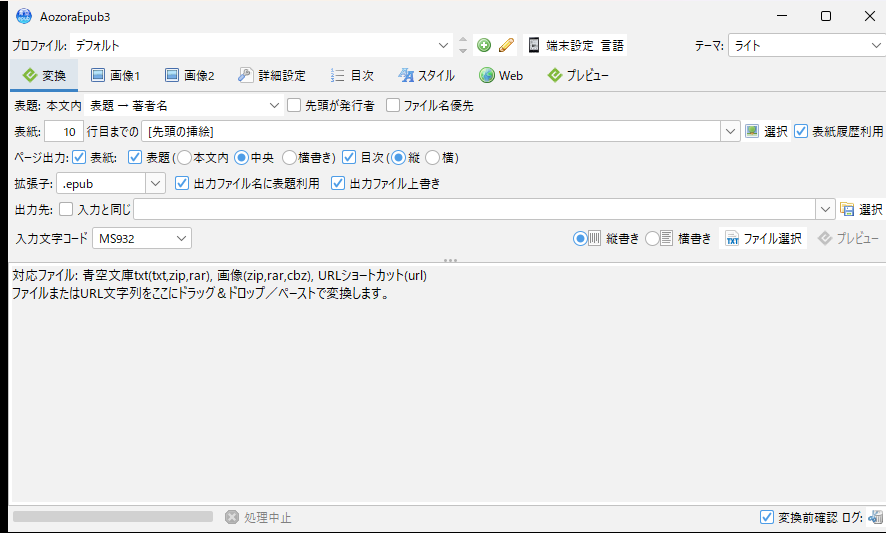
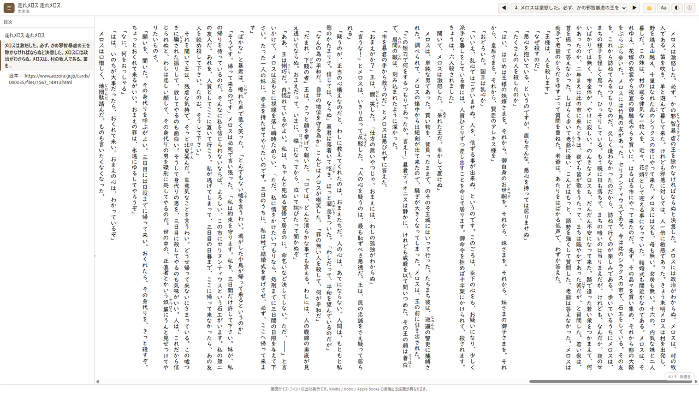

<div style="text-align: right; margin-bottom:  1em;">
  <a href="en/">🌐 English</a>
</div>

<nav style="background: #f6f8fa; padding:  1em; margin-bottom:  2em; border-radius:  6px;">
  <strong>📚 ドキュメント:</strong>
  <a href="./">ホーム</a> | 
  <a href="usage.html">使い方</a> | 
  <a href="narou-setup.html">narou.rb</a> |
  <a href="narou-rs-setup.html">narou.rs</a> |
  <a href="development.html">開発者向け</a> | 
  <a href="epub33-ja.html">EPUB 3.3準拠</a> |
  <a href="https://github.com/AozoraEpub3-JDK21/AozoraEpub3-JDK21">GitHub</a>
</nav>

## ダウンロード

<div style="text-align: center; margin: 2em 0;">
  <p><strong>最新版:</strong> v1.5.0-jdk21 (2026年8月11日) |
  <a href="https://github.com/AozoraEpub3-JDK21/AozoraEpub3-JDK21/releases/tag/v1.5.0-jdk21">リリースノート</a></p>

  <div style="display: inline-block; text-align: center;">
    <a href="https://github.com/AozoraEpub3-JDK21/AozoraEpub3-JDK21/releases/download/v1.5.0-jdk21/AozoraEpub3-1.5.0-jdk21.zip" class="btn" style="display: inline-block; margin: 10px; padding: 12px 24px;">
      📦 Windows版 (ZIP)
    </a>
    <a href="https://github.com/AozoraEpub3-JDK21/AozoraEpub3-JDK21/releases/download/v1.5.0-jdk21/AozoraEpub3-1.5.0-jdk21.tar.gz" class="btn" style="display: inline-block; margin: 10px; padding: 12px 24px;">
      🐧 Linux版 (TAR.GZ)
    </a>
    <a href="https://github.com/AozoraEpub3-JDK21/AozoraEpub3-JDK21/releases/download/v1.5.0-jdk21/AozoraEpub3-1.5.0-jdk21.tar.gz" class="btn" style="display: inline-block; margin: 10px; padding: 12px 24px;">
      🍎 macOS版 (TAR.GZ)
    </a>
  </div>
  
  <p><small><a href="https://github.com/AozoraEpub3-JDK21/AozoraEpub3-JDK21/releases">📋 すべてのリリースを見る</a></small></p>
</div>

---

## v1.5.0-jdk21 の主な変更

- **EPUB プレビュー機能**: 変換した EPUB を実機へ移す前に、既定のブラウザでそのまま確認できます。階層目次・フォント / 文字サイズ / 行間 / 余白の調整・ダークモード・本棚（フォルダから表紙サムネイル一覧、最大 8 フォルダ）に対応。CLI は `--preview` / `--library`、GUI は変換完了後の「プレビュー」ボタンから
- **GUI の見た目を FlatLaf でモダン化**: ライト / ダークテーマを同梱（既定はライト）。ini の `UiTheme` キーまたは画面右上のコンボで切替できます
- **ハーメルンの変換不能を修正**: 2026 年 8 月頃の話一覧 HTML 刷新に追従（旧キャッシュがあると初回だけ全話再取得になります）
- **カクヨムで新着話を取り逃す不具合を修正**: 話一覧キャッシュの保存先衝突により新着話が反映されないことがありました
- **GUI と CLI の設定既定値を統一**: ini にキーが無いときの CLI の挙動が GUI と揃い、章見出しが目次に入らない・自動改ページが効かない等の乖離を解消。同梱 ini を使った CLI 変換は出力が変わります（詳細はリリースノートの互換性欄）

過去のリリース内容は [リリース一覧](https://github.com/AozoraEpub3-JDK21/AozoraEpub3-JDK21/releases) を参照してください。

---

## 画面

<div style="display: flex; flex-wrap: wrap; gap: 1em; justify-content: center; margin: 2em 0;">
  <figure style="flex: 1 1 320px; max-width: 480px; margin: 0;">
    
    <figcaption style="text-align: center; font-size: 0.9em;">変換画面（ファイル／URL をドラッグ＆ドロップ）</figcaption>
  </figure>
  <figure style="flex: 1 1 320px; max-width: 480px; margin: 0;">
    
    <figcaption style="text-align: center; font-size: 0.9em;">ブラウザプレビュー（目次・縦書き・ルビ・段組）</figcaption>
  </figure>
</div>

変換した EPUB は、リーダーアプリに移す前に**ブラウザでそのままプレビュー**できます。  
画面例は青空文庫の『銀河鉄道の夜』（宮沢賢治、著作権保護期間満了）を変換したものです。

---

## このプロジェクトについて

本ソフトウェアは hmdev 氏の **AozoraEpub3** をベースに、narou.rbとの互換性維持、Java 21〜26 対応と最新 OS 向けの調整を行った派生版です。

EPUB 3.3 および 電書協／電書連 EPUB 3 制作ガイドの準拠を目指し、epubcheck 5.x で検証しています。

---

## 動作環境

- **Java 25 LTS 推奨**
  - Java 21 LTS との互換性を維持しています（JDK 26 ランタイムでも動作確認済）
  - 最低動作要件は **Java 21 以降**
- Windows / macOS / Linux

Java をお持ちでない場合は、[Eclipse Temurin](https://adoptium.net/temurin/releases/) から Java 25 LTS をダウンロードしてください（Java 21 LTS でも動作します）。

---

## Java 25 のインストール（Eclipse Temurin）

### Windows

1. [Adoptium Releases](https://adoptium.net/temurin/releases/) を開きます
2. JDK 25 → Windows x64 → `.MSI` を選択しダウンロードします
3. MSI ファイルをダブルクリックしインストールします
4. コマンドプロンプトで `java -version` を実行し確認します

### macOS

1. [Adoptium Releases](https://adoptium.net/temurin/releases/) を開きます
2. JDK 25 → macOS → `.PKG`（Intel または Apple Silicon M1/M2）をダウンロードします
3. PKG ファイルをダブルクリックしインストールします
4. ターミナルで `java -version` を実行し確認します

### Linux（Ubuntu/Debian）

1. [Adoptium Releases](https://adoptium.net/temurin/releases/) を開きます
2. JDK 25 → Linux x64 → `.TAR.GZ` をダウンロードします
3. 展開します: `tar -xzf OpenJDK25U-jdk_x64_linux_hotspot_25_x.tar.gz`
4. PATH に追加するか、`./jdk-25.x.x+yy/bin/java -version` で確認します

---

## 推奨手順（Windows）

1. 上記の **Windows版ダウンロード** ボタンから最新の ZIP ファイルをダウンロードします
2. 任意のフォルダに展開します
3. `AozoraEpub3.exe` をダブルクリックして起動します
4. GUI が表示されたらセットアップ完了です

> **注意**: JAR ファイルのダブルクリックが機能しない場合は EXE ファイルを使用してください。

---

## インストール（macOS / Linux）

1. 上記の **macOS版** または **Linux版ダウンロード** ボタンから TAR.GZ ファイルをダウンロードします
2. 展開します: `tar -xzf AozoraEpub3-*.tar.gz`
3. フォルダに移動し実行します: `./AozoraEpub3.sh`
4. 実行権限エラーの場合は先に実行: `chmod +x AozoraEpub3.sh`

---

## コマンドラインでの実行

詳細な設定が必要な場合は、コマンドラインから実行できます。

```bash
java -jar AozoraEpub3.jar -of -d out input.txt
```

GUI を起動する場合は引数なしで実行します: `java -jar AozoraEpub3.jar`

詳細は [README](https://github.com/AozoraEpub3-JDK21/AozoraEpub3-JDK21#readme) をご参照ください。

---

## 関連ガイド

- **[narou.rs 導入ガイド](narou-rs-setup.html)**（推奨） — Rust 製互換ツール narou.rs の導入と AozoraEpub3 連携（Windows 11・画像付き）。機能更新・セキュリティ修正が活発で、これから使い始める方におすすめです
- **[narou.rb 導入ガイド](narou-setup.html)** — Ruby 版 narou.rb の導入と AozoraEpub3 連携

---

## トラブルシューティング

- **Java がインストールされていない場合** — [Temurin](https://adoptium.net/temurin/releases/) から Java 25 LTS をダウンロードしインストールしてください（Java 21 以降であれば動作します）。
- **Windows で JAR ファイルが開かない場合** — EXE ファイルを使用するか、コマンドプロンプトから `java -jar AozoraEpub3.jar` で起動してください。
- **EXE 起動時に「Windows によって PC が保護されました」と出る** — SmartScreen の警告で、マルウェア検出ではありません。**ZIP を展開する前に**右クリック →プロパティ →「許可する」にチェックを入れると出なくなります。[詳しい手順](usage.html#aozoraepub3exe-の起動時にwindows-によって-pc-が保護されましたと出る)
- **Linux/macOS で permission denied エラー** — `chmod +x AozoraEpub3.sh` を実行し、再度起動してください。
- **narou.rb で「Javaがインストールされていないか…」と出るが Java は入っている** — 実際には EPUB の出力に失敗している可能性があります。v1.3.7-jdk21 から変換失敗時の終了コードが `0` → `1` に変わったためです（意図した変更）。[narou.rb 導入ガイド](narou-setup.html)を参照してください。
- **スクリプトから変換の成否を判定したい** — CLI は成功時 `0`、失敗時 `1` を返します。[使い方ガイドの「終了コード」](usage.html#終了コード)を参照してください。
- **その他の問題** — [GitHub Issues](https://github.com/AozoraEpub3-JDK21/AozoraEpub3-JDK21/issues) でご報告ください。

---

## 関連リソース

- [GitHub README](https://github.com/AozoraEpub3-JDK21/AozoraEpub3-JDK21#readme) — 機能・設定詳細
- [EPUB 3.3 日本語解説](epub33-ja.html) — 3.0 との差分と対応状況
- [English](en/index.html) — View this page in English
