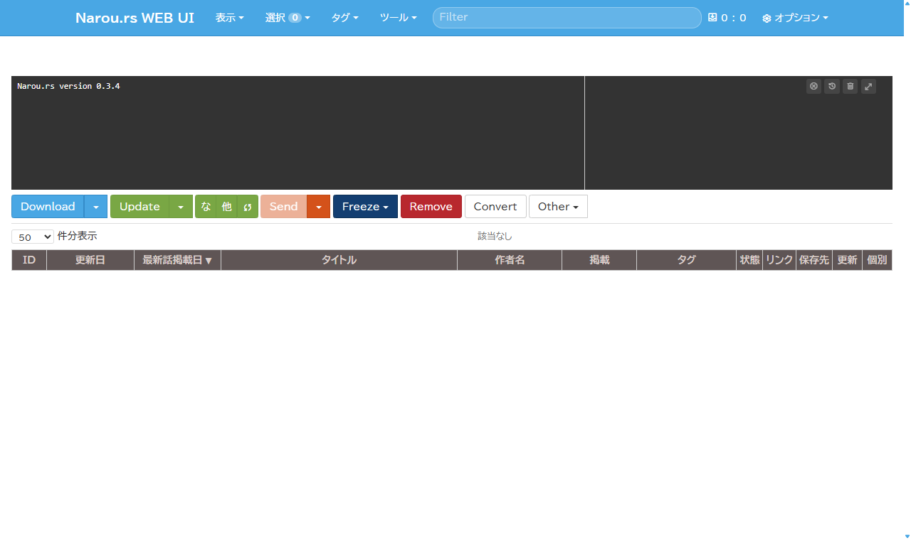
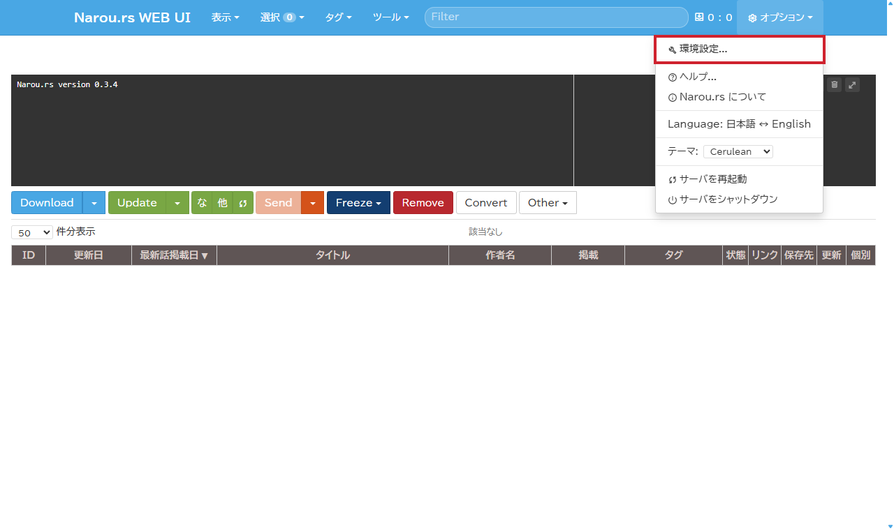
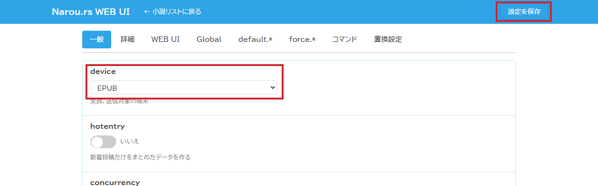
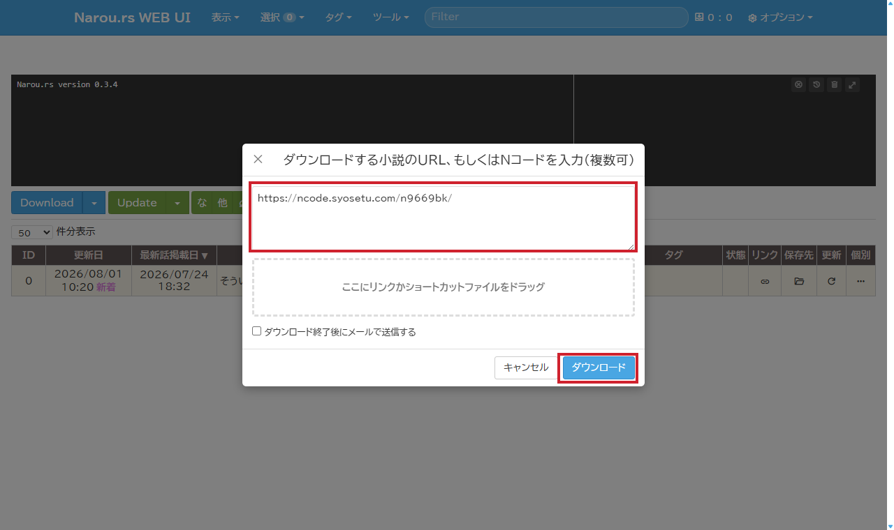

<div style="text-align: right; margin-bottom: 1em;">
  <a href="en/narou-rs-setup.html">🌐 English</a>
</div>

<nav style="background: #f6f8fa; padding: 1em; margin-bottom: 2em; border-radius: 6px;">
   <strong>📚 ドキュメント:</strong>
   <a href="./">ホーム</a> | 
   <a href="usage.html">使い方</a> | 
   <a href="narou-setup.html">narou.rb</a> |
   <strong>narou.rs</strong> |
   <a href="development.html">開発者向け</a> | 
   <a href="epub33-ja.html">EPUB 3.3準拠</a> |
   <a href="https://github.com/AozoraEpub3-JDK21/AozoraEpub3-JDK21">GitHub</a>
</nav>

## narou.rs 導入ガイド（Windows 11・画像付き）

> ⚠️ **注記**
> - 本記事は [narou.rs](https://github.com/Rumia-Channel/narou.rs) の公式マニュアルではありません。不明点は **[narou.rs の README](https://github.com/Rumia-Channel/narou.rs) や [Issues](https://github.com/Rumia-Channel/narou.rs/issues)** の最新情報を優先してください。
> - 検証環境: Windows 11（日本語）、narou.rs v0.3.4、AozoraEpub3 v1.4.0-jdk21

**narou.rs** は、Web 小説のダウンロード・更新・変換を行うツール [narou.rb](narou-setup.html) の互換ツール（Rust 実装）です。narou.rb と同じく変換エンジンに AozoraEpub3 を使います。

このページの手順を上から順に進めると、**ブラウザに小説の URL を貼るだけで EPUB ができる**環境が完成します。所要時間はおよそ 20〜30 分です。

### 全体の流れ

1. [Java を入れる](#1-java-を入れる)
2. [AozoraEpub3 を入れる](#2-aozoraepub3-を入れるnarours-専用フォルダに)
3. [narou.rs を入れる](#3-narours-を入れる)
4. [PATH に登録する](#4-path-に登録するつまずきやすいところ)
5. [初期化して AozoraEpub3 を登録する](#5-初期化して-aozoraepub3-を登録する)
6. [Web UI を開く](#6-web-ui-を開く)
7. [★ device を EPUB にする（必須）](#7--device-を-epub-にする必須)
8. [小説を登録して EPUB を取り出す](#8-小説を登録して-epub-を取り出す)

---

## 0. 準備するもの

- Windows 11 の PC とインターネット接続
- ソフトを置く場所（本ガイドでは `C:\Tools\` 配下を例にします）

> **Point**: ソフトを置くフォルダは、**半角英数字だけのパス**（例: `C:\Tools\narou`）にすると
> トラブルが起きにくくなります。日本語やスペースを含む場所（`ダウンロード` フォルダ、OneDrive 配下など）は避けてください。

---

## 1. Java を入れる

AozoraEpub3 の動作に Java が必要です。PowerShell（スタートボタンを右クリック →「ターミナル」）で次を実行して確認します。

```powershell
java -version
```

バージョン番号（`21` 以上）が表示されれば OK です。「認識されません」と出る場合は、
👉 **[トップページの Java インストールガイド](./#java-25-のインストールeclipse-temurin)** に従って **Eclipse Temurin の Java 25 LTS** を入れてください。

> ✅ **ここまでの確認**: `java -version` でバージョンが表示される

---

## 2. AozoraEpub3 を入れる（narou.rs 専用フォルダに）

1. **[AozoraEpub3-JDK21 のダウンロードページ](https://github.com/AozoraEpub3-JDK21/AozoraEpub3-JDK21/releases/latest)** から `AozoraEpub3-x.x.x-jdk21.zip` をダウンロードします。
2. zip を右クリック →「プロパティ」→ 下部に「許可する」チェックがあればオンにして「OK」（[SmartScreen 警告の回避](usage.html#aozoraepub3exe-の起動時にwindows-によって-pc-が保護されましたと出る)）。
3. zip を右クリック →「すべて展開」で `C:\Tools\AozoraEpub3-narou` のような**専用フォルダ**に展開します。

> ⚠️ **注意**: narou.rs は初期化のときに AozoraEpub3 の構成ファイル（`chuki_tag.txt`）を書き換えます。
> ほかの用途でも AozoraEpub3 を使っている場合は、**narou.rs 専用に別フォルダへ展開**してください（narou.rs 自身もそれを推奨しています）。

> ✅ **ここまでの確認**: 展開したフォルダの中に `AozoraEpub3.jar` がある

---

## 3. narou.rs を入れる

1. **[narou.rs の Releases ページ](https://github.com/Rumia-Channel/narou.rs/releases/latest)** から Windows 用の zip（`x86_64-pc-windows` を含む名前）をダウンロードします。
2. zip を右クリック →「すべて展開」します。中に `narou/` フォルダが入っているので、`C:\Tools\narou` になるように置きます。

展開後のフォルダはこのようになります（`narou_rs.exe` と `webnovel/` `preset/` は同じフォルダに置いたままにしてください）:

```text
C:\Tools\narou\
  narou_rs.exe
  narou_rs_updater.exe.new
  webnovel\
  preset\
  LICENSE / README.md など
```

> ⚠️ **注意**: 起動時に「`VCRUNTIME140.dll` が見つかりません」と出る場合は、
> Microsoft 公式の **[Visual C++ 再頒布可能パッケージ (x64)](https://learn.microsoft.com/cpp/windows/latest-supported-vc-redist)** をインストールしてください。

> ✅ **ここまでの確認**: `C:\Tools\narou` の中に `narou_rs.exe` がある

---

## 4. PATH に登録する（つまずきやすいところ）

どのフォルダからでも `narou_rs` コマンドを呼べるように、`narou_rs.exe` の場所を **PATH（コマンドの検索場所リスト）**に登録します。

- これから行うのは「あなたのユーザーの設定に、フォルダの場所を 1 行追記する」ことだけです。システム全体は変更しません。
- **元に戻したいとき**: 「環境変数」で検索 →「環境変数を編集」→ 上段の `Path` を選んで「編集」→ 追加した行を選んで「削除」するだけです。

PowerShell に次の 2 行を**そのまま**コピーして貼り付け、Enter を押してください（`C:\Tools\narou` を別の場所にした場合はそこだけ書き換えます）。

```powershell
$narouPath = "C:\Tools\narou"
[Environment]::SetEnvironmentVariable("Path", [Environment]::GetEnvironmentVariable("Path", "User") + ";" + $narouPath, "User")
```

**PowerShell をいったん閉じて、新しく開き直してください**（開き直すまで設定は反映されません）。

<details markdown="1">
<summary>コマンドを使わず、設定画面から登録する場合はこちら</summary>

1. スタートボタンを押して「**環境変数**」と入力 →「**環境変数を編集**」を開く
2. 上段「(ユーザー名) のユーザー環境変数」の **Path** を選んで「**編集**」
3. 「**新規**」→ `C:\Tools\narou` と入力 → OK → OK
4. 開いている PowerShell を閉じて開き直す

</details>

> ✅ **ここまでの確認**: **新しく開いた** PowerShell で `narou_rs version` と入力してバージョン番号（例: `0.3.4`）が表示される

---

## 5. 初期化して AozoraEpub3 を登録する

小説を管理するフォルダを作って、その中で初期化します。次の 3 行を PowerShell に貼り付けてください
（`-p` の後ろは**手順 2 で AozoraEpub3 を展開したフォルダ**に合わせます）。

```powershell
New-Item -ItemType Directory -Force -Path "C:\narou-novels" | Out-Null
Set-Location "C:\narou-novels"
narou_rs init -p "C:\Tools\AozoraEpub3-narou" -l 1.8
```

成功すると次のように表示されます:

```text
.narou/ を作成しました
小説データ/ を作成しました
webnovel/ を作成しました (6 files)
AozoraEpub3の設定を行います
!!!WARNING!!!
AozoraEpub3の構成ファイルを書き換えます。narouコマンド用に別途新規インストールしておくことをオススメします
AozoraEpub3 の構成ファイルを書き換えました
グローバル設定を保存しました
初期化が完了しました！
```

> **Point**: `-p` で AozoraEpub3 の場所、`-l 1.8` で行間（1.8 倍）を同時に設定しています。
> `-p` を付けずに `narou_rs init` だけを実行すると AozoraEpub3 の場所を対話形式で聞かれます。
> そこでスキップしてしまった場合も、**同じフォルダでもう一度 `narou_rs init -p ...` を実行**すれば登録できます
> （「既に初期化済みです」と表示されますが、AozoraEpub3 の設定はやり直せます）。

> ✅ **ここまでの確認**: 「初期化が完了しました！」が表示される

---

## 6. Web UI を開く

小説管理フォルダ（`C:\narou-novels`）で次を実行します。

```powershell
narou_rs web
```

ブラウザが自動で開き、narou.rs の画面（`http://localhost:16230/`）が表示されます。



- **この黒い画面（PowerShell）は閉じないでください**。閉じると Web UI も終了します（終了したいときは PowerShell で `Ctrl+C`）。
- 初回起動時に **Windows ファイアウォールの許可ダイアログ**が出たら「アクセスを許可する」を押してください。
- 初回は画面に「新機能ツアー」が表示されることがあります。「✓ 確認した」で閉じて構いません。

> ✅ **ここまでの確認**: ブラウザに「Narou.rs WEB UI」の画面が表示される

---

## 7. ★ device を EPUB にする（必須）

画面右上の「**⚙ オプション**」→「**環境設定...**」を開きます。



「一般」タブのいちばん上にある「**device**（変換、送信対象の端末）」を「**EPUB**」に変更し、右上の「**設定を保存**」を押します。



<div style="border-left: 4px solid #cf222e; background: #fff8f8; padding: 0.8em 1em; margin: 1em 0;">
<strong>この設定をしないと EPUB は出力されません。</strong>
Kindle など特定の端末をお使いの場合はその端末名でも構いませんが、「とりあえず EPUB が欲しい」場合は EPUB を選んでください。
</div>

「← 小説リストに戻る」で元の画面に戻ります。

> ✅ **ここまでの確認**: 環境設定を開き直すと device が EPUB になっている

---

## 8. 小説を登録して EPUB を取り出す

左上の「**Download**」ボタンを押すと入力欄が開きます。読みたい小説のページ（小説家になろう・カクヨムなど）の **URL を貼り付けて「ダウンロード」**を押してください。



ダウンロードから EPUB への変換まで自動で進みます。完了すると小説がリストに追加されるので、**「保存先」列のフォルダボタン**を押すと、できあがった `.epub` ファイルの場所が開きます。


EPUB は `C:\narou-novels\小説データ\（サイト名）\（作品名）\` に保存されています。あとはお使いのリーダー（スマホのアプリ、Kindle など）に送るだけです。

> **Point**: 連載の続きを取り込みたいときは「**Update**」ボタンを押すだけです。新しい話を取得して EPUB を作り直します。

> ✅ **ここまでの確認**: フォルダの中に `.epub` ファイルがある

---

## 困ったときは

| 症状 | 対処 |
|------|------|
| `narou_rs` は「認識されません」と出る | PATH 登録後に PowerShell を開き直したか確認 → [手順 4](#4-path-に登録するつまずきやすいところ) |
| `VCRUNTIME140.dll が見つかりません` | Visual C++ 再頒布可能パッケージを入れる → [手順 3](#3-narours-を入れる) |
| 「Windows によって PC が保護されました」 | [SmartScreen 警告の回避方法](usage.html#aozoraepub3exe-の起動時にwindows-によって-pc-が保護されましたと出る) |
| 変換時に Java 関連のエラーが出る | Java が入っているか確認 → [手順 1](#1-java-を入れる) |
| 変換はされるが `.epub` ファイルがない | device が EPUB になっているか確認 → [手順 7](#7--device-を-epub-にする必須) |
| ファイアウォールの画面が出た | 「アクセスを許可する」を押す（localhost で動くだけなので外部公開はされません） |

---

## 参考リンク

- [narou.rs（GitHub）](https://github.com/Rumia-Channel/narou.rs) — README・最新リリース・不具合報告
- [AozoraEpub3 の使い方](usage.html) — 変換の詳細設定
- [narou.rb 導入ガイド](narou-setup.html) — Ruby 版 narou.rb を使う場合
- [AozoraEpub3-JDK21 Releases](https://github.com/AozoraEpub3-JDK21/AozoraEpub3-JDK21/releases) — AozoraEpub3 本体のダウンロード

---

<div style="text-align: right;"><small>情報更新日: 2026-08-01 | 本記事は narou.rs 公式ドキュメントではありません</small></div>
