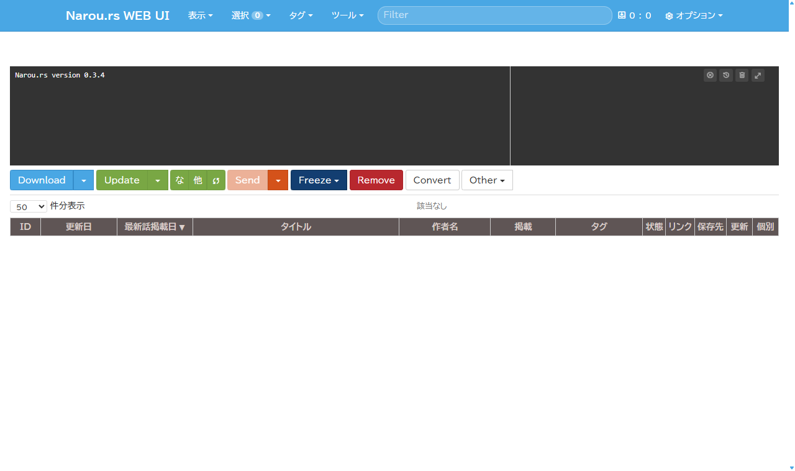
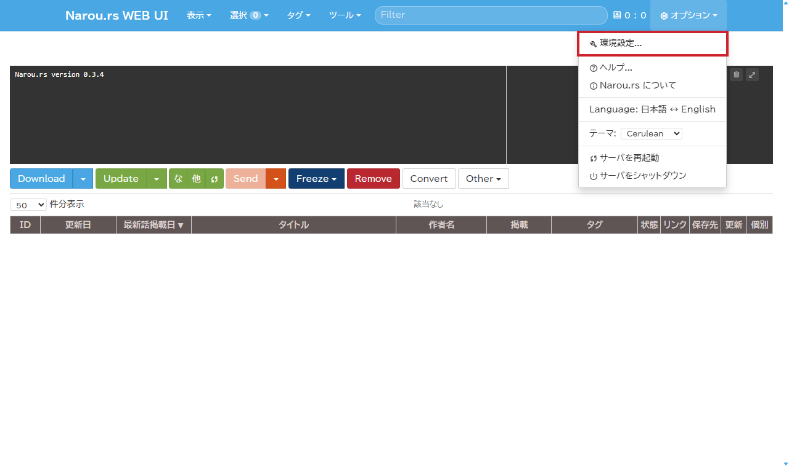
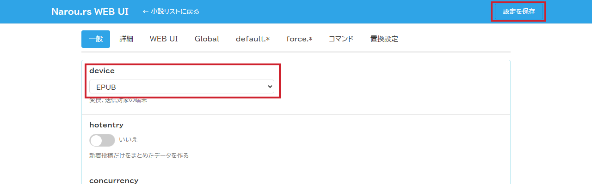
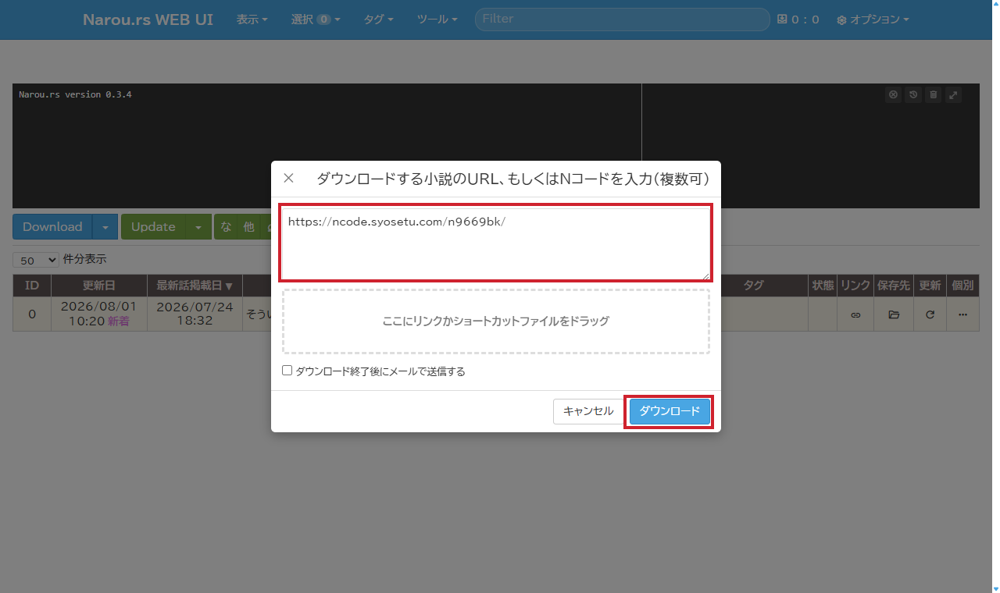

<div style="text-align: right; margin-bottom: 1em;">
  <a href="en/narou-rs-setup.html">🌐 English</a>
</div>

<nav style="background: #f6f8fa; padding: 1em; margin-bottom: 2em; border-radius: 6px;">
   <strong>📚 ドキュメント:</strong>
   <a href="./">ホーム</a> | 
   <a href="usage.html">使い方</a> | 
   <a href="gaiji-settings.html">外字の設定</a> | 
   <a href="narou-setup.html">narou.rb</a> |
   <strong>narou.rs</strong> |
   <a href="development.html">開発者向け</a> | 
   <a href="epub33-ja.html">EPUB 3.3準拠</a> |
   <a href="https://github.com/AozoraEpub3-JDK21/AozoraEpub3-JDK21">GitHub</a>
</nav>

## narou.rs 導入ガイド（Windows 11・画像付き）

> ⚠️ **注記**
> - 本記事は [narou.rs](https://github.com/Rumia-Channel/narou.rs) の公式マニュアルではありません。不明な点は **[narou.rs の README](https://github.com/Rumia-Channel/narou.rs) や [Issues](https://github.com/Rumia-Channel/narou.rs/issues)** の最新情報を優先してください。
> - 検証環境: Windows 11（日本語）、narou.rs v0.3.4（手順・画面）/ v0.4.4（2 種類の配布版の動作確認・出力比較）、AozoraEpub3 v1.4.0-jdk21（手順・画面）/ v1.6.1-jdk21（出力比較）

**narou.rs**（開発: [Rumia-Channel](https://github.com/Rumia-Channel) 氏）は、Web 小説のダウンロード・更新・変換を行うツール [narou.rb](narou-setup.html)（whiteleaf7 氏作）の互換ツールです。Rust で実装されており、narou.rb と同じく変換エンジンに AozoraEpub3 を使用します。v0.4.0 からは、EPUB 変換エンジンを組み込んだ **GPL 版**も配布されています（[下記](#editions)）。

本ガイドの手順を上から順に進めると、**小説の URL を貼り付けるだけで EPUB が生成される**環境が完成します。所要時間は 15〜20 分程度です。

<a id="editions"></a>

### 2 種類の配布版（v0.4.0 以降）

narou.rs v0.4.0 以降は、同じバージョンが 2 種類の zip で配布されています。

| | 通常版 | GPL 版 |
|---|---|---|
| zip の名前（Windows 64bit） | `narou_rs_win_x64.zip` | `narou_rs_win_x64-GPL.zip` |
| EPUB 変換エンジン | 外部の AozoraEpub3（本ガイドの AozoraEpub3-JDK21 など） | 組み込みの [AozoraEpub3_Lite](https://github.com/Rumia-Channel/AozoraEpub3_Lite)（AozoraEpub3 の Rust 移植） |
| Java | 必要 | **不要** |
| AozoraEpub3 のダウンロード | 必要 | **不要** |
| ライセンス | BSD-2-Clause | GPL-3.0 |

**GPL 版を使う場合は、手順 1（Java）と手順 2（AozoraEpub3）を飛ばせます。** 手順 3 で `-GPL` 付きの zip をダウンロードし、手順 4 の初期化では AozoraEpub3 を登録しません（[手順 4](#4-初期化と-aozoraepub3-の登録) の GPL 版の説明を参照）。手順 5 以降は通常版と同じです。

どちらを選ぶかの目安は次のとおりです。

- **GPL 版**: Java を入れずに、とにかく手軽に始めたい場合
- **通常版**: AozoraEpub3 本体で変換したい場合。AozoraEpub3 側の設定（`AozoraEpub3.ini`・外字フォント・変換後の自動プレビューなど）がそのまま効きます

> **Point**: GPL 版でも、AozoraEpub3 を登録している場合（`init -p` で登録した・`AozoraEpub3` に PATH が通っている など）は**そちらが優先して使われます**。組み込みエンジンが使われるのは、AozoraEpub3 が見つからないときだけです。
> また、AozoraEpub3 を登録していない場合は、AozoraEpub3 の `gaiji` フォルダに置く外字フォントは使われません。

> **Point**: あとから版を切り替える場合は、もう一方の zip をダウンロードして `C:\Tools\narou` に上書き展開します。セルフアップデートで取得する版は、Web UI の環境設定（Global タブ）の `self-update.variant` で選べます（`gpl` = GPL 版 / `standard` = 通常版）。

#### ライセンスが分かれている理由

AozoraEpub3（hmdev 氏の原作と、そこから派生した改造版 AozoraEpub3（kyukyunyorituryo 氏）・AozoraEpub3-JDK21 など）は **GPL-3.0** で公開されています。GPL のプログラムを組み込んだソフトウェアを配布する場合、その配布物全体を GPL で配布しなければなりません（**ライセンスの伝搬**）。AozoraEpub3_Lite は AozoraEpub3 を移植したものなので GPL-3.0 です。そのため、これを組み込んだ narou.rs は配布物全体が GPL-3.0 になり、BSD-2-Clause の通常版とは別の zip で配布されています。通常版は AozoraEpub3 を別のプログラムとして呼び出すだけなので、BSD-2-Clause のままです。

ライセンスの違いが関係するのは、**プログラムを改変したり再配布したりする場合**です。ダウンロードして使うだけなら、どちらの版を選んでも問題ありません。

#### 出力の比較（本サイトでの実測）

小説家になろうの 4 作品（1,404 話の長編 1 作を含む、本文ファイル計 1,678 個）を同じ本文データから変換し、GPL 版の組み込みエンジンと AozoraEpub3-JDK21 v1.6.1 の出力を比べました（narou.rs v0.4.4）。

| 項目 | 結果 |
|---|---|
| 変換 | 4 作品ともどちらのエンジンでも成功 |
| 本文の文字 | 全ファイルで一致 |
| ルビ（読みを含む） | 全 15 か所で一致 |
| 挿絵 | 対象作品に挿絵がなく、未確認 |
| epubcheck 5.2.0 | どちらもエラー・警告なし |
| EPUB の内部構成 | **異なる**。組み込みエンジンは[改造版 AozoraEpub3](https://github.com/kyukyunyorituryo/AozoraEpub3)（kyukyunyorituryo 氏、電書連 EPUB 3 制作ガイドに沿ったフォーク）と同じ `item/` 配下の構成、AozoraEpub3-JDK21 は `OPS/` 配下の構成 |
| 見出し・中扉のマークアップ | **異なる**。例: 話の見出しは組み込みエンジンでは `<h2>`、AozoraEpub3-JDK21 では `<div class="chap2">` |

読める内容は同じですが、マークアップや CSS が異なるため、見出しの大きさや中扉のレイアウトなどの見た目が異なる場合があります。

### 全体の流れ

1. [Java のインストール](#1-java-のインストール)
2. [AozoraEpub3 の準備](#2-aozoraepub3-の準備narours-専用フォルダ)
3. [narou.rs のダウンロードと展開](#3-narours-のダウンロードと展開)
4. [初期化と AozoraEpub3 の登録](#4-初期化と-aozoraepub3-の登録)
5. [Web UI の起動](#5-web-ui-の起動)
6. [★ 出力を EPUB に設定（必須）](#6--出力を-epub-に設定必須)
7. [小説の登録と EPUB の取り出し](#7-小説の登録と-epub-の取り出し)

---

## 0. 準備するもの

- Windows 11 の PC とインターネット接続

本ガイドでは、次の 3 つのフォルダ構成で説明します。別の場所に置く場合は、コマンド内のパスを読み替えてください。

| フォルダ | 用途 |
|---|---|
| `C:\Tools\AozoraEpub3-jdk21` | AozoraEpub3（変換エンジン） |
| `C:\Tools\narou` | narou.rs 本体 |
| `C:\Tools\narou-novels` | 小説の保存・管理フォルダ |

> **Point**: インストール先は**半角英数字だけのパス**にするとトラブルを避けられます。
> 日本語やスペースを含む場所（`ダウンロード` フォルダや OneDrive 配下など）は避けてください。

### PowerShell の開き方

本ガイドでは、コマンド入力用の画面（**PowerShell**）を何度か使います。次のどちらかの方法で開けます。

- **スタートボタンを右クリック** → 「**ターミナル**」を選ぶ
- スタートボタンを押して「**powershell**」と入力 → 「Windows PowerShell」を開く

また、エクスプローラーで開いているフォルダ内の何もない場所を右クリック →「**ターミナルで開く**」を選ぶと、**そのフォルダの場所で**コマンド入力画面（通常は PowerShell）が開きます（手順 4・5 で使います）。

コピーしたコマンドは、PowerShell の画面上で**右クリック**（または `Ctrl+V`）すると貼り付けられます。管理者として実行する必要はありません。

---

## 1. Java のインストール

> **GPL 版を使う場合、この手順は不要です** → [手順 3](#3-narours-のダウンロードと展開) へ進んでください。

AozoraEpub3 の実行には Java が必要です。まず、すでにインストールされているかを PowerShell で確認します。

```powershell
java -version
```

バージョン番号（`21` 以上）が表示されれば OK です。「認識されません」と表示された場合は、
👉 **[トップページの Java インストールガイド](./#java-25-のインストールeclipse-temurin)** に従って **Eclipse Temurin の Java 25 LTS** をインストールしてください。

> ✅ **ここまでの確認**: `java -version` でバージョンが表示される

---

## 2. AozoraEpub3 の準備（narou.rs 専用フォルダ）

> **GPL 版を使う場合、この手順は不要です** → [手順 3](#3-narours-のダウンロードと展開) へ進んでください。

1. **[AozoraEpub3-JDK21 のダウンロードページ](https://github.com/AozoraEpub3-JDK21/AozoraEpub3-JDK21/releases/latest)** から `AozoraEpub3-x.x.x-jdk21.zip` をダウンロードします。
2. zip を右クリック →「すべて展開」を選び、展開先の欄に `C:\Tools\AozoraEpub3-jdk21` と入力して展開します。

> ⚠️ **注意**: narou.rs は初期化の際に AozoraEpub3 の構成ファイル（`chuki_tag.txt`）を書き換えます。
> AozoraEpub3 をほかの用途でも使っている場合は、**narou.rs 専用として別のフォルダに展開**してください（narou.rs 自身も専用インストールを推奨しています）。

> ✅ **ここまでの確認**: `C:\Tools\AozoraEpub3-jdk21` を開くと、**その直下に** `AozoraEpub3.jar` がある。
> さらに一段深いフォルダの中に入ってしまっている場合は、その中身をすべて `C:\Tools\AozoraEpub3-jdk21` の直下に移動してください。

---

## 3. narou.rs のダウンロードと展開

1. **[narou.rs の Releases ページ](https://github.com/Rumia-Channel/narou.rs/releases/latest)** の「Assets」から Windows 用の zip をダウンロードします。
   - 通常版: `narou_rs_win_x64.zip`
   - GPL 版: `narou_rs_win_x64-GPL.zip`（[2 種類の配布版](#editions)を参照）
   - ARM 版 Windows の PC では、名前が `win_arm64` のものを選びます。
2. zip を右クリック →「すべて展開」します。展開すると `narou` フォルダができるので、`C:\Tools\narou` となるように移動します。

展開後の構成は次のとおりです（通常版・GPL 版とも同じ）。

```text
C:\Tools\narou\
  narou_rs.exe
  narou_rs_updater.exe.new
  narou_rs_backup.exe
  narou_rs_login.exe
  webnovel\
  preset\
  commitversion
  LICENSE / README.md / Third-Party-License.md
```

> ⚠️ **注意**: `narou_rs.exe` は同じフォルダにある `webnovel\`・`preset\`・`commitversion` を参照して動作します。
> **これらを別の場所に移動したり削除したりしないでください。**

> ⚠️ **注意**: 起動時に「`VCRUNTIME140.dll` が見つかりません」と表示された場合は、
> Microsoft 公式の **[Visual C++ 再頒布可能パッケージ](https://learn.microsoft.com/cpp/windows/latest-supported-vc-redist)** をインストールしてください（通常は x64 版、ARM 版 Windows では ARM64 版）。

> ✅ **ここまでの確認**: PowerShell で `C:\Tools\narou\narou_rs.exe version` と入力すると、バージョン番号（例: `0.4.4`）が表示される

---

## 4. 初期化と AozoraEpub3 の登録

小説を保存・管理するフォルダを作り、その中で初期化コマンドを 1 行実行します。

1. エクスプローラーのアドレス欄に `C:\Tools` と入力して開き、何もない場所を右クリック →「新規作成」→「フォルダー」を選び、フォルダ名を `narou-novels` と入力して Enter を押します。
2. 作成した `narou-novels` フォルダを開き、フォルダ内の何もない場所を右クリック →「**ターミナルで開く**」を選びます（行頭に `C:\Tools\narou-novels` と表示された画面が開きます）。
3. 開いた画面に次の 1 行を貼り付けて、Enter を押します。

```powershell
C:\Tools\narou\narou_rs.exe init -p "C:\Tools\AozoraEpub3-jdk21"
```

成功すると、次のように表示されます。

```text
.narou/ を作成しました
小説データ/ を作成しました
webnovel/ を作成しました (6 files)
AozoraEpub3の設定を行います
!!!WARNING!!!
AozoraEpub3の構成ファイルを書き換えます。narouコマンド用に別途新規インストールしておくことをオススメします
AozoraEpub3 の構成ファイルを書き換えました
グローバル設定を保存しました
初期化が完了しました！
```

**GPL 版の場合**は、AozoraEpub3 を登録せずに初期化します。上のコマンドの代わりに次の 1 行を実行し、「AozoraEpub3のあるフォルダを入力して下さい」と聞かれたら、**何も入力せずに Enter** を押します。

```powershell
C:\Tools\narou\narou_rs.exe init
```

途中で「!!!WARNING!!! AozoraEpub3の構成ファイルを書き換えます…」と表示されますが、AozoraEpub3 を登録しない場合は何も書き換えられないので、気にせず進めて構いません。最後に「AozoraEpub3 の設定をスキップしました」「初期化が完了しました！」と表示されれば OK です（EPUB への変換には組み込みエンジンが使われます）。

> **Point**: `-p` には**手順 2 で AozoraEpub3 を展開したフォルダ**を指定します。
> 行間は標準で 1.8 倍に設定されます（変えたい場合のみ `-l 2.0` のように追加します）。
> スタートメニューから開いた PowerShell で実行する場合は、先に `cd C:\Tools\narou-novels` と入力して現在地を移動してください（手順 5 も同様です）。
> 登録に失敗した場合も、**同じフォルダでもう一度 `init -p ...` を実行**すればやり直せます
> （「既に初期化済みです」と表示されますが、AozoraEpub3 の設定はやり直せます）。

> ⚠️ **注意**: 小説管理フォルダは、narou.rs 本体のフォルダ（`C:\Tools\narou`）の**中には作らないでください**。
> narou.rs は本体フォルダと小説管理フォルダを分ける前提で設計されています（公式 README の指示）。

> ✅ **ここまでの確認**: 「初期化が完了しました！」と表示される

---

## 5. Web UI の起動

手順 4 と同じように、エクスプローラーで `C:\Tools\narou-novels` を開き、フォルダ内の何もない場所を右クリック →「**ターミナルで開く**」を選んで、次の 1 行を実行します。**次回以降もこの操作だけで起動できます。**

```powershell
C:\Tools\narou\narou_rs.exe web
```

ブラウザが自動的に開き、narou.rs の画面が表示されます。アドレスは `http://localhost:（ポート番号）/` の形式で、**ポート番号は初回起動時に自動で決まり、次回以降も同じ番号が使われます**。



- **Web UI を使っている間は、PowerShell の画面を閉じないでください**（閉じると Web UI も終了します）。終了するときは PowerShell で `Ctrl+C` を押します。
- 初回起動時に **Windows ファイアウォールの許可ダイアログ**が表示されたら、「アクセスを許可する」を押してください。
- 初回は「新機能ツアー」が表示されることがあります。「✓ 確認した」で閉じて構いません。

> ✅ **ここまでの確認**: ブラウザに「Narou.rs WEB UI」の画面が表示される

---

## 6. ★ 出力を EPUB に設定（必須）

画面右上の「**⚙ オプション**」→「**環境設定...**」を開きます。



「一般」タブの最上部にある「**device**（変換、送信対象の端末）」を「**EPUB**」に変更し、右上の「**設定を保存**」を押します。



<div style="border-left: 4px solid #cf222e; background: #fff8f8; padding: 0.8em 1em; margin: 1em 0;">
<strong>この設定を行わないと EPUB は出力されません。</strong>
Kindle など特定の端末で読む場合はその端末名を選んでも構いませんが、迷ったら EPUB を選んでください。
</div>

「← 小説リストに戻る」で元の画面に戻ります。

> ✅ **ここまでの確認**: 環境設定を開き直すと device が EPUB になっている

---

## 7. 小説の登録と EPUB の取り出し

画面左上の「**Download**」ボタンを押すと、URL の入力画面が開きます。読みたい小説のページ（小説家になろう・カクヨムなど）の **URL を貼り付けて「ダウンロード」**を押してください。



ダウンロードから EPUB への変換までが自動で進みます。完了すると小説がリストに追加されるので、**「保存先」列のフォルダボタン**を押すと、変換された `.epub` ファイルの保存先フォルダが開きます。


EPUB の保存先は `C:\Tools\narou-novels\小説データ\（サイト名）\（作品名）\` です。この `.epub` ファイルをお使いのリーダー（スマートフォンのアプリや Kindle など）に転送すれば読めます。

> **Point**: 連載の続きが公開されたら、「**Update**」ボタンを押してください。新しい話を取得して EPUB を作り直します。

> ✅ **ここまでの確認**: 保存先フォルダの中に `.epub` ファイルがある

---

## PATH への登録（任意）

毎回 `C:\Tools\narou\narou_rs.exe` と入力する代わりに、`narou_rs` だけで呼び出せるようにする設定です。**なくても本ガイドの手順はすべて動作します**（narou.rs 公式 README は PATH 登録を前提に説明していますが、本ガイドのフルパス実行でも動作は同じです）。

<details markdown="1">
<summary>設定手順を見る</summary>

PowerShell に次の 2 行を**そのまま**貼り付けて Enter を押し（実行するのは **1 回だけ**）、**PowerShell を開き直します**。

```powershell
$narouPath = "C:\Tools\narou"
[Environment]::SetEnvironmentVariable("Path", [Environment]::GetEnvironmentVariable("Path", "User") + ";" + $narouPath, "User")
```

以降は新しく開いた PowerShell で `narou_rs web` のように短く入力できます。

元に戻すには: スタートボタン → 「環境変数」と入力 → 「アカウントの環境変数を編集」→ 上段の **Path** を選んで「編集...」→ `C:\Tools\narou` の行を選んで「削除」→ 「OK」で閉じます。

</details>

---

## 困ったときは

| 症状 | 対処 |
|------|------|
| 「`VCRUNTIME140.dll` が見つかりません」と表示される | Visual C++ 再頒布可能パッケージをインストールしてください → [手順 3](#3-narours-のダウンロードと展開) |
| `narou_rs` が「認識されません」と表示される | フルパス（`C:\Tools\narou\narou_rs.exe`）で実行してください。短く呼びたい場合は [PATH への登録（任意）](#path-への登録任意)を参照してください |
| 「Windows によって PC が保護されました」と表示される | `narou_rs.exe` をダブルクリックで起動した場合などに表示されることがあります。[SmartScreen 警告の回避方法](usage.html#aozoraepub3exe-の起動時にwindows-によって-pc-が保護されましたと出る)と同じ手順で回避できます |
| 変換時に Java 関連のエラーが出る | Java がインストールされているか確認してください → [手順 1](#1-java-のインストール)。GPL 版でも、AozoraEpub3 を登録していると Java が使われます → [2 種類の配布版](#editions) |
| 変換時に「`AozoraEpub3 not found`」と表示される | 通常版で AozoraEpub3 が登録されていません。手順 2 の後に `init -p ...` を実行してください → [手順 4](#4-初期化と-aozoraepub3-の登録)。Java や AozoraEpub3 を使わずに変換したい場合は GPL 版を使います → [2 種類の配布版](#editions) |
| 変換はされるが `.epub` ファイルが見つからない | device が EPUB になっているか確認してください → [手順 6](#6--出力を-epub-に設定必須) |
| 初期化したのに Web UI に反映されない・小説リストが空 | 別のフォルダでコマンドを実行した可能性があります。コマンド入力画面の行頭に `C:\Tools\narou-novels` と表示されているか確認してください → [手順 4](#4-初期化と-aozoraepub3-の登録) |
| ファイアウォールの許可画面が表示された | 「アクセスを許可する」を押してください（localhost で動作するだけで、外部には公開されません） |

---

## 参考リンク

- [narou.rs（GitHub）](https://github.com/Rumia-Channel/narou.rs) — README・最新リリース・不具合報告
- [AozoraEpub3_Lite（GitHub）](https://github.com/Rumia-Channel/AozoraEpub3_Lite) — GPL 版に組み込まれている変換エンジン
- [AozoraEpub3 の使い方](usage.html) — 変換の詳細設定
- [narou.rb 導入ガイド](narou-setup.html) — Ruby 版 narou.rb を使う場合
- [AozoraEpub3-JDK21 Releases](https://github.com/AozoraEpub3-JDK21/AozoraEpub3-JDK21/releases) — AozoraEpub3 本体のダウンロード

---

<div style="text-align: right;"><small>情報更新日: 2026-09-27 | 本記事は narou.rs 公式ドキュメントではありません</small></div>
